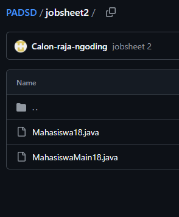
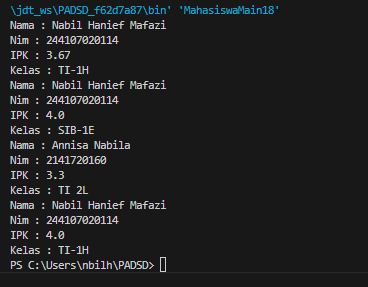
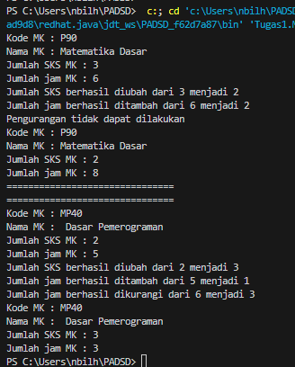
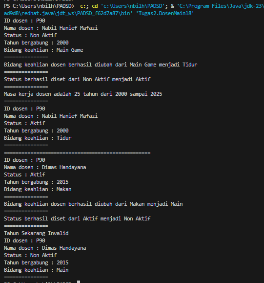

|  | Algorithm and Data Structure |
|--|--|
| NIM |  2441070202114|
| Nama |  Nabil Hanief Mafazi |
| Kelas | TI - 1H |
| Repository | [link] (https://github.com/Calon-raja-ngoding/PADSD.git) |

# OBJECT
## 2.1 Deklarasi kelas, attribut, dan method

**Maaf tidak ada bukti screenshot karna progam saya tidak bisa dirun dikarenakan tidak ada fungsi main**
***
**Penjelesan singkat:** 
Disini ada 3 step utama: 

1. **Mendeklarasikan class :**
   - `Mahasiswa18.java`
2.  **Mendeklarasikan Attribute :**
    -   nama String
    -   nim String
    -   kelas String
    -   ipk double
3.  **Membuat Method :**
    
    -   ubahKelas
    -   updateIPK
    -   nilaiKinerja.  
 ***
  **Pertanyaan :**
  1. **Sebutkan dua karakteristik class atau object!**
   - Memiliki Attribute
   - Memiliki Method
 2. **Perhatikan class Mahasiswa pada Praktikum 1 tersebut, ada berapa atribut yang dimiliki oleh class Mahasiswa? Sebutkan apa saja atributnya!**
  -  Ada 4 attribute yaitu :
     -   nama String
     -   nim String
     -   kelas String
     -   ipk double
 
 3. **Ada berapa method yang dimiliki oleh class tersebut? Sebutkan apa saja methodnya!**
  -  Ada 3 attribute yaitu :
     -   ubahKelas
     -   updateIPK
     -   nilaiKinerja.  
 
4. **Perhatikan method updateIpk() yang terdapat di dalam class Mahasiswa. Modifikasi isi method tersebut sehingga IPK yang dimasukkan valid yaitu terlebih dahulu dilakukan pengecekan apakah IPK yang dimasukkan di dalam rentang 0.0 sampai dengan 4.0 (0.0 <= IPK <= 4.0). Jika IPK tidak pada rentang tersebut maka dikeluarkan pesan: "IPK tidak valid. Harus antara 0.0 dan 4.0".**
 

       String  nilaiKinerja(){
           if (ipk  <=  4.0  &&  ipk  >=  0.0) {
                if (ipk  >=  3.5) {
                     return  "Kinerja sangat baik";
                }else  if (ipk  >=  3.0) {
                     return  "Kinerja baik";
                }else  if (ipk  >=  2.0) {
                     return  "Kinerja cukup";
                }else { return  "Kinerja kurang "; }
           }else { return  "IPK tidak valid. Harus diantara 0.0 dan 4.0"; }
       }
  5. **Jelaskan bagaimana cara kerja method nilaiKinerja() dalam mengevaluasi kinerja mahasiswa, kriteria apa saja yang digunakan untuk menentukan nilai kinerja tersebut, dan apa yang dikembalikan (di-return-kan) oleh method nilaiKinerja() tersebut?**
  - Method `nilaiKinerja()`Mengambil nilai dari `ipk` lalu mengecek apakah `(ipk <= 4.0 && ipk >= 0.0)` jika tidak maka akan mereturn `"IPK tidak valid. Harus antara 0.0 dan 4.0"` jika iya maka akan melanjutkan pengecekan nilai ipk masuk dikategori mana, dimulai dari kategori `(ipk >= 3.5)` sampai `(ipk < 2.0)` , lalu akan mereturn sesuai dari ketentuan masing masing kategori seperti kategori `(ipk >= 3.5)` mereturn `"Kinerja sangat baik"` . 
6. **Commit dan push kode program ke Github**
 
	
***
## 2.2 Percobaan 2: Instansiasi Object, serta Mengakses   Atribut dan Method

 	
***
**Penjelesan singkat:** 
Disini ada 5 step utama: 

1. **Mendeklarasikan class**
   - `MahasiswaMain18.java`
2.  **Memanggil konstruktor**
3. **Mebuat Object**
    -  `mhs1` .
4.  **Menginput nilai konstruktor**
5. **Memanggil method dari konstruktor**
 ***
  **Pertanyaan :**
  1. **Pada class MahasiswaMain, tunjukkan baris kode program yang digunakan untuk proses instansiasi! Apa nama object yang dihasilkan?**

         Mahasiswa18  mhs1  =  new  Mahasiswa18();

   - Oject yg dihasilkan adalah `mhs1` .
 2. **Bagaimana cara mengakses atribut dan method dari suatu objek?**
  -  Kita harus membuat konstruktor di class object nya, lalu memanggil konstruktor di class tempat kita membuat objectnya, setelah itu melengkapi nilai dari attribute objectnya, lalu panggil method yang ingin digunakan, jika method berparameter maka lengkapi parameternya .

 3. **Mengapa hasil output pemanggilan method tampilkanInformasi() pertama dan kedua berbeda?**
  -  Karena kita memanggil method `ubahKelas()` dan `updateIpk()` dimana kedua method tersebut digunakan untuk mengubah nilai dari `kelas` dan `ipk`.
 ***
## 2.3 Membuat Konstruktor

 

***
**Penjelesan singkat:** 
Disini ada 5 step utama: 

1. **Membuat konstruktor**
2.  **Memanggil konstruktor**
3. **Membuat object**
   - `mhs2` .
4.  **Melengkapi Parameter Konstruktor**
5. **Memanggil method dari konstruktor**
 ***
  **Pertanyaan :**
  1. **Pada class Mahasiswa di Percobaan 3, tunjukkan baris kode program yang digunakan untuk mendeklarasikan konstruktor berparameter**
 

         public  Mahasiswa18(String  nama, String  nim, double  ipk, String  kelas){
              this.nama  =  nama;
              this.nim  =  nim;
              this.ipk  =  ipk;
              this.kelas  =  kelas;
         }

 2. **Perhatikan class MahasiswaMain. Apa sebenarnya yang dilakukan pada baris program berikut?**

        Mahasiswa18  mhs2  =  new  Mahasiswa18("Annisa Nabila", "2141720160", 3.25, "TI 2L");

 
- Membuat object `mhs2` menggunakan konstruktor berparameter dari `mahasiswa18` .
3. **Hapus konstruktor default pada class Mahasiswa, kemudian compile dan run program. Bagaimana hasilnya? Jelaskan mengapa hasilnya demikian!**
  -  Hasilnya error dikarenakan salah satu konstruktor yang dipanggil atau lebih tepatnya konstruktor default itu tidak ada atau tidak terdefinisikan.
 
4. **Setelah melakukan instansiasi object, apakah method di dalam class Mahasiswa harus diakses secara berurutan? Jelaskan alasannya!**
- Tidak karena setiap method itu berdiri sendiri jadi kita bisa menyesuaikan dengan kebutuhan .

 5. **Buat object baru dengan nama mhs menggunakan konstruktor berparameter dari class Mahasiswa!**

         Mahasiswa18  mhsNabilHaniefMafazi  =  new  Mahasiswa18("Nabil Hanief Mafazi",         "244107020114", 4.00, "TI-1H");
         mhsNabilHaniefMafazi.tampilkanInformasi();

6. **Commit dan push kode program ke Github**
 
	
***
## Tugas 1

 

***
**Penjelesan singkat:** 
Disini ada 7 step utama: 

1. **Mendeklarasikan class**
- `MataKuliah18()` .
- `MataKuliahMain18()` .
2.  **Mendeklarasikan  attribute dan method**
- Attribute :
  - `kodeMK` .
  - `nama` .
  - `sks` .
  - `jumlahJam` .
- `Method` :
  - `tampilInformasi()` .
  - `ubahSKS()` .
  - `tambahJam()` .
  - `kurangiJam()` . 
3. **Mendelarasikan Konstruktor default dan parameter**
4.  **Membuat object**
- `mk1` .
- `mk2` . 
5. **Melengkapi nilai object**
6. **Memanggil method pakai konstruktor**
7. **Menampilkan hasil**
 ***
## Tugas 2
 

***
**Penjelesan singkat:** 
Disini ada 7 step utama: 

1. **Mendeklarasikan class**
- `Dosen8()` .
- `DosenMain18()` .
2.  **Mendeklarasikan  attribute dan method**
- Attribute :
  - `idDosen` .
  - `nama` .
  - `statusAktif` .
  - `tahunBergabung` .
  - `bidangKeahlian` .
- `Method` :
  - `tampilInformasi()` .
  - `ubahKeahlian()` .
  - `hitungMasaKerja()` .
  - `setStatus()` . 
3. **Mendelarasikan Konstruktor default dan parameter**
4.  **Membuat object**
- `dosen1` .
- `dosen2` . 
5. **Melengkapi nilai object**
6. **Memanggil method pakai konstruktor**
7. **Menampilkan hasil**
8. **Commit dan push ke github**
 
 ***
## Terima Kasih :)

